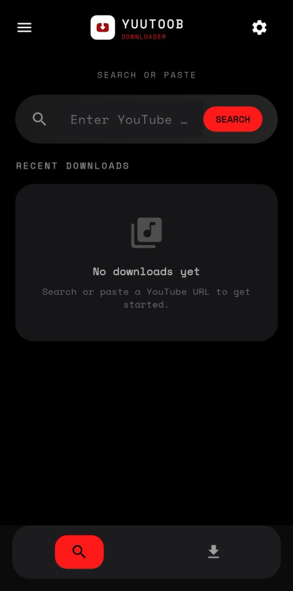
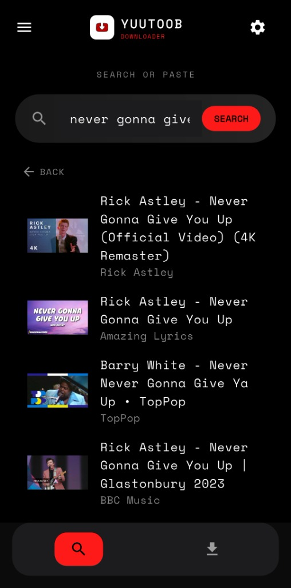
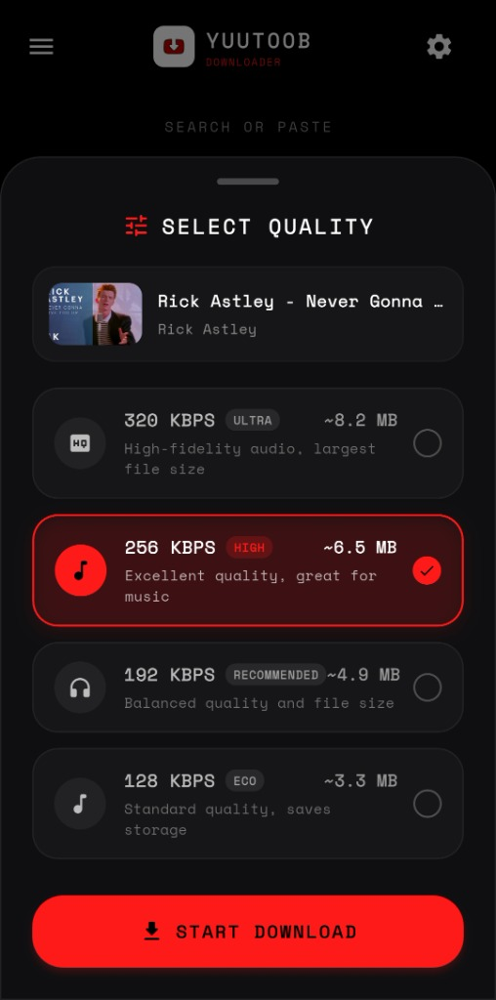
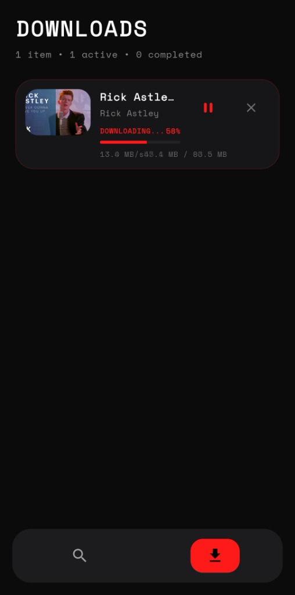
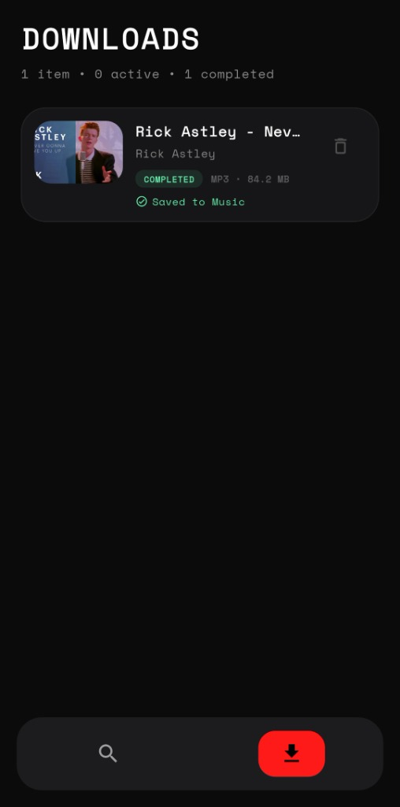
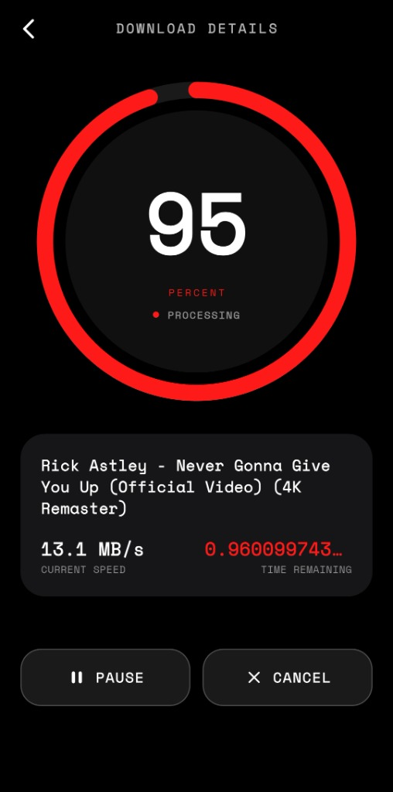
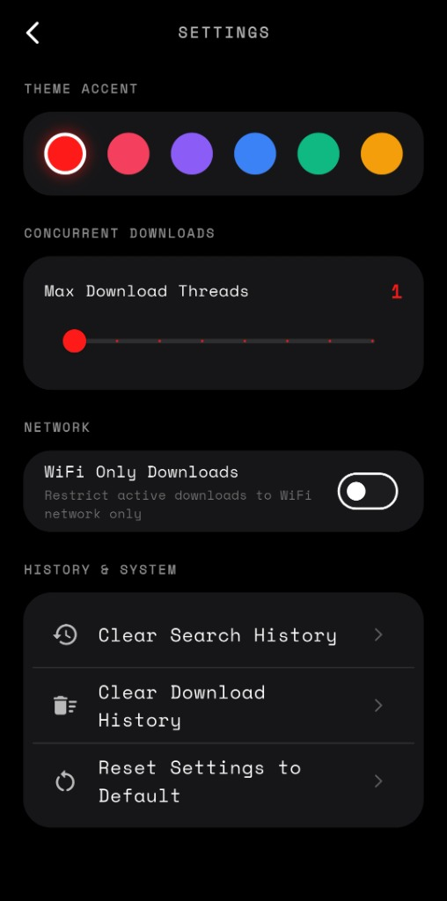

# YT Downloader App

A full-stack mobile application that allows users to search, preview, and download YouTube audio directly to their device with real-time progress tracking.

---

## Features

* **Search YouTube videos** using keywords
* **Paste direct YouTube links** for instant access
* **Download audio (MP3)** with selectable quality
* **Real-time progress tracking** (speed, ETA, percentage)
* **Saves files directly to device storage** (Downloads folder)
* **Clipboard auto-detection** for quick link input
* **Download history tracking**
* **Cancel downloads anytime**

---

## Screenshots

### Search & Discovery

| Home Screen | Search Results | Video Details |
| :---: | :---: | :---: |
|  |  |  |

### Quality Selection & Downloads

| Select Quality | Active Download | Download Completed |
| :---: | :---: | :---: |
|  |  |  |

### Details & Settings

| Download Progress Details | Settings Screen |
| :---: | :---: |
|  |  |

---

## Tech Stack

### Frontend

* Flutter
* Dart
* Flutter Downloader (DownloadManager integration)

### Backend

* FastAPI
* yt-dlp
* Python
* FFmpeg (for audio conversion)

---

##  Setup Instructions

###  1. Clone Repository

```bash
git clone https://github.com/yourusername/yt-downloader.git
cd yt-downloader
```

---

## Backend Setup (FastAPI)

### Install dependencies

```bash
cd backend
pip install -r requirements.txt
```

### Install FFmpeg (required)

* Download from: https://ffmpeg.org/download.html
* Add to system PATH

### Run backend server

```bash
uvicorn main:app --host 0.0.0.0 --port 8000 --reload
```

---

## Frontend Setup (Flutter)

### Install dependencies

```bash
cd frontend
flutter pub get
```

### Run app

```bash
flutter run
```

---

## Build APK

```bash
flutter build apk --release
```

APK will be available at:

```
build/app/outputs/flutter-apk/app-release.apk
```

---

## Notes

* Requires internet connection
* YouTube extraction depends on yt-dlp updates
* FFmpeg must be installed for MP3 conversion

---

## Security Considerations

* **CORS Restrictions**: By default, if the `ALLOWED_ORIGINS` environment variable is not defined, the server defaults to allowing cross-origin requests from any origin (`*`). For production or shared environments, restrict origins by setting the environment variable `ALLOWED_ORIGINS` to a comma-separated list of allowed origins (e.g. `ALLOWED_ORIGINS=https://app.yourdomain.com`).
* **Path Traversal Protection**: The backend enforces that only files generated inside the dedicated `downloads/` folder can be retrieved via the `/file/{job_id}` endpoint, resolving all paths and rejecting any outside file reads.
* **Server Resource Limits**: The server restricts active parallel downloads to a maximum of 10 concurrent jobs and validates fragmentation threads (max 8 per download) to protect the host from Denial-of-Service (DoS) and IP rate-limiting.

